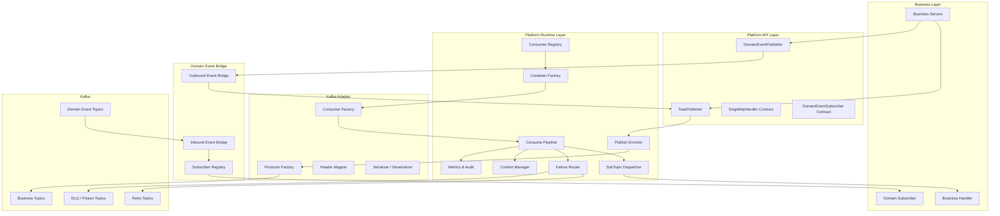
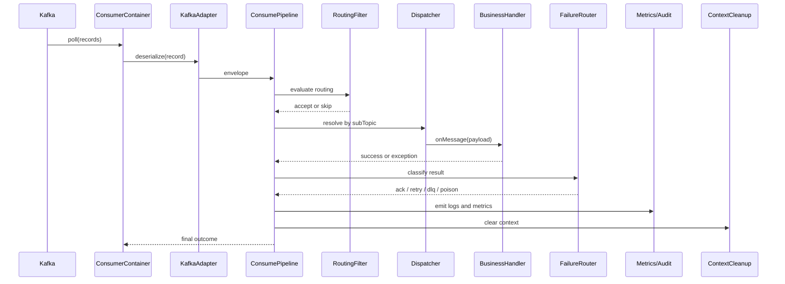
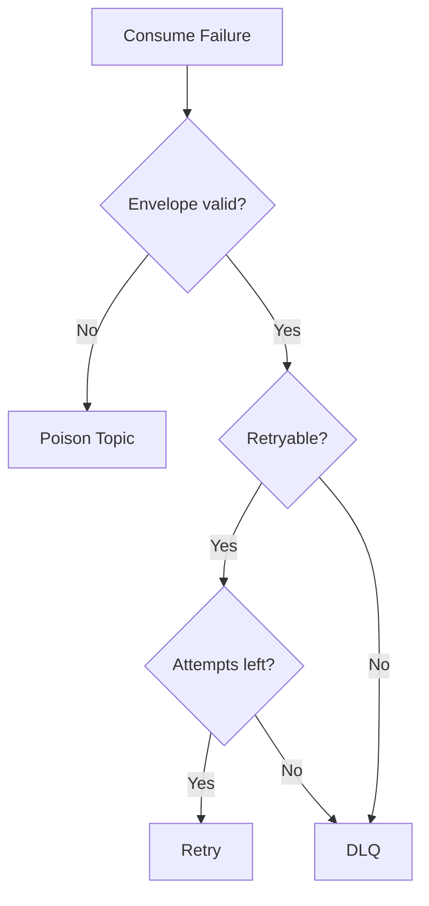
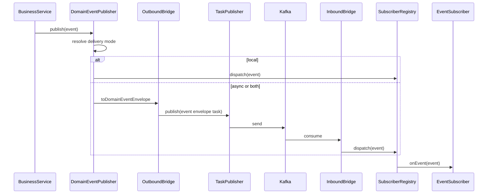

# AsyncMQ Platform on Kafka Detailed Design

## Document Control

| Field | Value |
| --- | --- |
| Status | Draft |
| Based On | `docs/asyncmq-platform-kafka-technical-design.md` |
| Companion Doc | `docs/asyncmq-platform-kafka-v1-implementation-checklist.md` |
| Last Updated | 2026-04-15 |
| Goal | Provide an implementation-grade detailed design for the v1 async messaging platform |

---

## Table of Contents

1. [Overview](#1-overview)
2. [Design Scope](#2-design-scope)
3. [Detailed Architecture](#3-detailed-architecture)
4. [Module and Package Design](#4-module-and-package-design)
5. [Topic and Catalog Design](#5-topic-and-catalog-design)
6. [Configuration Schema](#6-configuration-schema)
7. [Message Contract Design](#7-message-contract-design)
8. [Producer Flow Design](#8-producer-flow-design)
9. [Consumer Flow Design](#9-consumer-flow-design)
10. [Retry, DLQ, and Poison Design](#10-retry-dlq-and-poison-design)
11. [Routing, Ordering, and Broadcast Design](#11-routing-ordering-and-broadcast-design)
12. [Domain Event Detailed Design](#12-domain-event-detailed-design)
13. [Observability and Runtime Controls](#13-observability-and-runtime-controls)
14. [Security, Compliance, and Data Governance](#14-security-compliance-and-data-governance)
15. [Deployment and Rollout Design](#15-deployment-and-rollout-design)
16. [Testing and Acceptance Strategy](#16-testing-and-acceptance-strategy)
17. [Migration Strategy](#17-migration-strategy)
18. [Open Questions](#18-open-questions)
19. [Appendix](#19-appendix)

---

## 1. Overview

### 1.1 Purpose

This document expands the high-level technical design into a more implementation-oriented design that engineering teams can use to build the v1 platform.

The technical design answers:

- what the platform is
- why the abstractions exist
- what belongs in scope for v1

This detailed design answers:

- how the modules interact
- how startup and runtime behavior works
- how failures are classified and routed
- how messages are structured and governed
- how teams should adopt the platform safely

### 1.2 Intended Audience

- platform engineers implementing the messaging foundation
- service teams onboarding to the platform
- reviewers assessing operability and rollout risk
- technical leads decomposing the work into deliverable epics

### 1.3 Relationship to Existing Docs

| Document | Primary Role |
| --- | --- |
| `asyncmq-platform-kafka-technical-design.md` | high-level architecture, goals, boundaries |
| `asyncmq-platform-kafka-detailed-design.md` | implementation-grade system design |
| `asyncmq-platform-kafka-v1-implementation-checklist.md` | work breakdown and delivery plan |

---

## 2. Design Scope

### 2.1 V1 Functional Scope

V1 will deliver:

- a Kafka-backed task publishing abstraction
- a configuration-driven consumer registration model
- a standard consume pipeline
- subTopic-based dispatch
- retry, DLQ, and poison handling
- local and MQ-backed domain event delivery
- baseline observability and operational controls

### 2.2 V1 Non-Functional Scope

V1 must be:

- production-safe for one or more reference workloads
- observable enough for troubleshooting and rollout
- extensible for delayed delivery and outbox later
- strict about module boundaries to avoid raw Kafka sprawl

### 2.3 Explicit Deferred Items

These items are intentionally designed as extension points but not built into v1:

- delay and fixed-time scheduler implementation
- generic outbox relay service
- schema registry
- tenant-specific traffic shaping
- full hot-reload of runtime bindings
- transactional messaging as the default consistency solution

---

## 3. Detailed Architecture

### 3.1 Component View

### 3.2 Architectural Decision Summary

| Concern | Detailed Decision |
| --- | --- |
| Transport hiding | Business code never sees Kafka producer or consumer classes |
| Dispatch key | `subTopic` is part of the standard envelope contract |
| Binding ownership | Consumer topology is primarily configuration-owned |
| Runtime governance | All cross-cutting concerns run in a shared consume pipeline |
| Failure policy | Retry and DLQ are policy-driven, not handler-specific |
| Event transport | Domain event publishing is abstracted behind a bridge |
| Extension model | Delay, outbox, and cluster routing are extension points, not v1 blockers |

---

## 4. Module and Package Design

### 4.1 Module Responsibilities

#### `mq-core-api`

Responsibilities:

- envelope contracts
- metadata contracts
- publish and consume interfaces
- standard result and error contracts

Must not include:

- Kafka-specific classes
- Spring lifecycle logic
- retry, routing, or metrics implementations

#### `mq-runtime`

Responsibilities:

- producer-side message preparation
- consumer-side registration and dispatch
- consume pipeline execution
- failure routing and retry decisions
- context recovery and cleanup

Must not include:

- direct Kafka client setup logic
- domain-event business modeling

#### `mq-kafka-adapter`

Responsibilities:

- Kafka producer and consumer construction
- record-level header mapping
- serialization and deserialization adaptation
- commit and polling coordination

Must not include:

- business handler dispatch policy
- high-level retry or DLQ semantics

#### `mq-spring-starter`

Responsibilities:

- Spring Boot auto-configuration
- typed property binding
- handler scanning
- startup validation and reporting

#### `domain-event-core`

Responsibilities:

- event type definition
- event identity conventions
- publisher abstraction
- subscriber abstraction
- local dispatch

#### `domain-event-mq-bridge`

Responsibilities:

- event envelope mapping
- MQ delivery of domain events
- MQ consumption of event envelopes
- delivery mode coordination

### 4.2 Suggested Internal Package Layout

| Module | Suggested Internal Areas |
| --- | --- |
| `mq-core-api` | `contract`, `metadata`, `publisher`, `handler`, `result`, `error` |
| `mq-runtime` | `publish`, `registry`, `dispatch`, `pipeline`, `routing`, `failure`, `context` |
| `mq-kafka-adapter` | `producer`, `consumer`, `serde`, `header`, `factory` |
| `mq-spring-starter` | `config`, `autoconfigure`, `validation`, `health` |
| `domain-event-core` | `event`, `publisher`, `subscriber`, `registry`, `strategy` |
| `domain-event-mq-bridge` | `bridge.outbound`, `bridge.inbound`, `mapping`, `delivery` |

### 4.3 Ownership Guidance

| Area | Preferred Owner |
| --- | --- |
| API contracts | platform foundation team |
| runtime behavior | platform runtime team |
| Kafka integration | platform infra team |
| event contracts | domain/event platform team |
| topic catalog governance | architecture + owning service teams |

---

## 5. Topic and Catalog Design

### 5.1 Why Topic Governance Needs to Be Explicit

Without a topic catalog, Kafka topics tend to accumulate inconsistent names, retention rules, and ownership. The platform should therefore treat topic metadata as first-class governance data.

### 5.2 Topic Categories

| Category | Purpose |
| --- | --- |
| business task topic | standard async tasks |
| domain event topic | asynchronous domain event transport |
| retry topic | retryable failures |
| DLQ topic | non-retryable or exhausted failures |
| poison topic | malformed or non-deserializable records |
| audit topic | optional future extension for centralized audit streaming |

### 5.3 Topic Catalog Fields

| Field | Description |
| --- | --- |
| `topicName` | canonical topic name |
| `category` | business, event, retry, DLQ, poison |
| `ownerTeam` | owning team |
| `businessDomain` | bounded context or domain |
| `retentionClass` | short, standard, or long |
| `containsPII` | yes or no |
| `encryptionRequired` | yes or no |
| `schemaOwner` | team responsible for payload contract |
| `replayAllowed` | whether replay is operationally supported |

### 5.4 Naming Convention

Recommended conventions:

- topic: `<domain>_<channel>_topic`
- retry topic: `<topic>_retry`
- DLQ topic: `<topic>_dlq`
- poison topic: `<topic>_poison`
- subTopic: `<bounded_context>_<business_action>`
- group: `<service>` or `<service>_<scope>`

### 5.5 Topic Creation Policy

V1 should avoid one-topic-per-action proliferation. New business actions should usually be modeled as subTopics under a bounded-context topic unless there is a clear operational reason to isolate traffic.

### 5.6 When a New Topic Is Justified

- independent retention requirements
- materially different throughput or lag characteristics
- distinct security classification
- independent rollback or replay requirements
- cross-domain ownership boundaries

---

## 6. Configuration Schema

### 6.1 Configuration Layers

The platform configuration is divided into four layers:

1. connection and transport
2. producer defaults
3. consumer topology
4. runtime governance

### 6.2 Connection Schema

| Field | Required | Description |
| --- | --- | --- |
| `bootstrapServers` | yes | Kafka cluster endpoints |
| `securityProtocol` | environment-dependent | transport security mode |
| `saslMechanism` | environment-dependent | auth mechanism |
| `clientIdPrefix` | yes | base producer and consumer client id |
| `sslEnabled` | environment-dependent | whether TLS is enabled |

### 6.3 Producer Default Schema

| Field | Required | Description |
| --- | --- | --- |
| `acks` | yes | producer ack mode |
| `retries` | yes | send retry count |
| `lingerMs` | yes | batching delay |
| `batchSize` | yes | batch size |
| `compressionType` | no | compression strategy |
| `requestTimeoutMs` | yes | producer request timeout |
| `deliveryTimeoutMs` | yes | end-to-end send timeout |
| `defaultSchemaVersion` | yes | envelope schema version |

### 6.4 Consumer Binding Schema

| Field | Required | Description |
| --- | --- | --- |
| `handlerClass` | yes | handler type |
| `enabled` | yes | binding on/off |
| `topic` | yes | single topic or list |
| `group` | yes | consumer group |
| `subTopics` | yes | allowed dispatch keys |
| `consumeMode` | yes | `normal`, `broadcast`, `sequential` |
| `broadcastScope` | if broadcast | `instance`, `region`, or future scope |
| `concurrency` | yes | number of parallel workers |
| `maxPollRecords` | yes | per poll batch limit |
| `startupMode` | yes | `fail-fast` or `warn-and-disable` |
| `retryProfile` | yes | retry behavior profile |
| `routingProfile` | no | routing rule profile |
| `idempotencyProfile` | no | dedupe policy |

### 6.5 Runtime Control Schema

| Field | Purpose |
| --- | --- |
| `pausedBindings` | stop message dispatch for named bindings |
| `forcedConcurrency` | temporary concurrency overrides |
| `trafficDrainMode` | pause new consumption while processing inflight work |
| `disableRetryBindings` | send failures directly to DLQ for named bindings |

### 6.6 Validation Matrix

| Validation Rule | Behavior |
| --- | --- |
| missing topic | fail startup |
| missing subTopics | fail startup |
| duplicate `(topic, group, subTopic)` with incompatible handlers | fail startup |
| sequential mode without key strategy | fail startup |
| broadcast mode without scope | fail startup |
| retry profile missing | fail startup |
| unknown handler class | fail startup |

### 6.7 Configuration Source Strategy

V1 should support static Spring Boot configuration first. Dynamic runtime control may be integrated with a configuration center later, but the configuration model must already anticipate that need.

---

## 7. Message Contract Design

### 7.1 Task Envelope Semantics

`TaskEnvelope` is the platform's canonical async task container.

| Field | Type Semantics | Notes |
| --- | --- | --- |
| `taskId` | immutable id | generated once per logical task |
| `traceId` | immutable correlation id | copied from request if present |
| `name` | logical label | useful for audit and dashboards |
| `topic` | transport channel | not used for business dispatch alone |
| `subTopic` | business dispatch key | required for runtime dispatch |
| `payload` | business content | serialized independently |
| `payloadType` | type discriminator | required for diagnostics and evolution |
| `schemaVersion` | envelope version | used by deserializer |
| `key` | ordering key | drives partition placement |
| `tracking` | cross-thread metadata | request and identity context |
| `routing` | cluster and tenant metadata | consumed by routing filters |
| `delivery` | delivery metadata | retry, delay, dedupe, TTL |
| `producedAt` | timestamp | source of latency metrics |

### 7.2 Required Envelope Rules

- `taskId` is required for every task before publish.
- `traceId` must be present before send, even if generated at publish time.
- `subTopic` is required for all business tasks.
- `payloadType` must be stable enough for audit and compatibility debugging.
- `schemaVersion` must default consistently across producers.

### 7.3 Header Contract

Headers are used for lightweight routing and diagnostics. V1 should standardize at least:

- `traceId`
- `taskId`
- `subTopic`
- `payloadType`
- `schemaVersion`
- `attempt`
- `notBefore`
- `sourceService`

### 7.4 Payload Compatibility Rules

- payload evolution should be backward compatible where feasible
- new optional fields are preferred over breaking replacement
- consumers must tolerate unknown fields
- envelope and payload versioning are related but not identical concerns

### 7.5 Domain Event Envelope Semantics

The domain event transport model must preserve:

- event identity
- event name
- event class hint
- serialized event body
- producer service
- delivery scope constraints
- routing account or routing object
- delay intent when applicable

### 7.6 Message Size Guidance

The platform should define advisory limits for message size and log warnings or reject payloads that exceed approved thresholds. Large binary payloads should not be transported directly; instead, messages should reference external storage.

---

## 8. Producer Flow Design

### 8.1 Publish Flow Responsibilities

The publish path is responsible for:

- validating publish intent
- enriching metadata
- mapping key and headers
- serializing payload and envelope
- sending via Kafka adapter
- recording send result and latency

### 8.2 Publish Steps

1. Business service invokes `TaskPublisher`.
2. Runtime validates topic, subTopic, payload, and schema version.
3. Runtime generates missing `taskId` and `traceId`.
4. Runtime injects tracking and routing metadata from current execution context.
5. Runtime resolves partition key.
6. Runtime delegates to the Kafka adapter.
7. Adapter sends the record and returns success or failure outcome.
8. Runtime records metrics and logs audit information.

### 8.3 Publish Validation Rules

| Rule | Result if Violated |
| --- | --- |
| missing topic | reject before send |
| missing subTopic | reject before send |
| null payload | reject before send |
| unsupported schema version | reject before send |
| invalid key type | reject before send |

### 8.4 Publish Failure Handling

Producer failures should be classified as:

- validation failure
- serialization failure
- transport failure
- timeout
- interrupted send

V1 publish API should surface enough failure data for caller-side logging and fallback behavior.

### 8.5 Publish Audit Fields

- taskId
- traceId
- topic
- subTopic
- producer service
- payloadType
- send duration
- result
- exception class if failed

---

## 9. Consumer Flow Design

### 9.1 Startup Flow

At application startup:

1. Spring starter loads typed configuration.
2. Handler scanner finds all `SingleMqHandler` beans.
3. Consumer registry matches bindings to handlers.
4. Validator checks binding consistency.
5. Container factory creates topic/group containers.
6. Dispatch table for subTopics is assembled.
7. Containers subscribe and begin polling.
8. Startup summary is logged and exposed in health output.

### 9.2 Runtime Consume Flow

1. Kafka consumer polls records.
2. Adapter deserializes record into envelope.
3. Pipeline validates schema and metadata.
4. Context manager restores trace and request scope.
5. Routing filters decide whether current consumer should process the message.
6. Dispatcher resolves handler by subTopic.
7. Business handler processes payload.
8. Failure router decides ack, retry, DLQ, or poison outcome.
9. Metrics and audit are emitted.
10. Context is cleaned up.
11. Offset is committed according to runtime policy.

### 9.3 Detailed Consumer Sequence

### 9.4 Offset Commit Strategy

V1 should use manual commit tied to platform outcome handling.

Recommended rules:

- commit only after successful handling or explicit final routing
- do not commit before retry or DLQ publishing has been confirmed
- preserve enough metadata to avoid silent message loss

### 9.5 Skip Behavior

Some messages may be intentionally skipped because of routing mismatch. A skip is not a failure. It should still be visible in metrics, but not counted as handler failure.

---

## 10. Retry, DLQ, and Poison Design

### 10.1 Failure Classification Model

The platform should convert raw exceptions into one of four outcomes:

- success
- retry
- DLQ
- poison

### 10.2 Recommended Classification Rules

| Failure Source | Outcome |
| --- | --- |
| malformed envelope | poison |
| unknown schema version | poison or DLQ based on policy |
| handler throws declared retryable error | retry |
| transient downstream timeout | retry |
| validation failure in business logic | DLQ |
| exhausted retry attempts | DLQ |

### 10.3 Retry Flow

Retry should preserve the original business envelope and add:

- current attempt
- original topic
- failure classification
- next eligible processing time if delayed retry is used later

### 10.4 Retry Topology for V1

V1 should support:

- same-process immediate retry for limited transient cases
- retry topic publishing for bounded delayed redelivery by policy

If delayed redelivery is not implemented in v1, retry topics may still be used as explicit retry lanes with operational awareness.

### 10.5 DLQ Record Design

DLQ entries must preserve:

- original message
- original topic
- original partition
- original offset
- consumer group
- handler class
- attempt count
- failure class
- failure message
- timestamp

### 10.6 Poison Record Design

Poison records are for messages that the runtime cannot safely understand. Poison topics must store raw bytes or original serialized value plus parse failure metadata for later investigation.

### 10.7 Failure Decision Table

---

## 11. Routing, Ordering, and Broadcast Design

### 11.1 Routing Design Goals

Routing should ensure that only the appropriate consumers handle the message when scope rules exist, while keeping those rules centralized and observable.

### 11.2 Routing Profiles

Routing profiles should support future strategies such as:

- account-based routing
- region-based routing
- cluster-based routing
- tenant shard routing

V1 implementation may keep routing simple while preserving a stable extension point.

### 11.3 Ordering Rules

- ordering is guaranteed only within a key
- sequential handlers must require a key strategy
- handlers must not assume ordering across different keys or partitions

### 11.4 Broadcast Rules

Broadcast behavior must be explicit because Kafka group semantics are not broadcast by default.

Recommended v1 strategy:

- instance-level broadcast uses a unique group suffix per instance
- region-level broadcast uses a region-specific unique suffix or scoped group

### 11.5 Routing Evaluation Position

Routing evaluation must happen in the consume pipeline before business handler invocation and after envelope deserialization.

---

## 12. Domain Event Detailed Design

### 12.1 Domain Event vs Async Task

Use an async task when:

- the message represents a work request
- the sender expects a specific downstream action
- the transport channel is tightly coupled to one execution flow

Use a domain event when:

- the message represents a business fact
- multiple subscribers may react independently
- the publisher should not know all consumers

### 12.2 Domain Event Publisher Responsibilities

- accept domain events from business code
- apply event identity and trace metadata
- determine delivery strategy
- dispatch locally and/or through MQ bridge

### 12.3 Local Delivery Detailed Flow

1. Business service publishes event.
2. Publisher resolves event name and delivery mode.
3. Local subscriber registry looks up interested subscribers.
4. Subscribers are invoked in process.
5. Publisher records success or failure telemetry.

### 12.4 Async Delivery Detailed Flow

1. Business service publishes event.
2. Publisher selects async or both mode.
3. Outbound bridge converts event into `DomainEventEnvelope`.
4. Bridge uses `TaskPublisher` to send envelope to event topic.
5. Event consumer receives envelope.
6. Inbound bridge restores domain event.
7. Bridge applies event delivery constraints.
8. Local subscriber registry dispatches the event.

### 12.5 Delivery Constraint Rules

Transport metadata must support:

- producer service identity
- same-group-only delivery
- cross-group allowed delivery
- target cluster restrictions

### 12.6 Domain Event Compatibility Strategy

- event name is the stable business identifier
- event class name is a helpful but secondary hint
- unknown fields in event data should be tolerated
- event subscribers should prefer event-name based dispatch over raw class-name assumptions

### 12.7 Domain Event Sequence

---

## 13. Observability and Runtime Controls

### 13.1 Required Metrics Set

Producer metrics:

- send count
- send success count
- send failure count
- send latency

Consumer metrics:

- polled record count
- consumed success count
- consumed skip count
- retry count
- DLQ count
- poison count
- handler latency
- consumer lag

Domain event metrics:

- local dispatch count
- async dispatch count
- subscriber count by event name
- event dispatch failure count

### 13.2 Structured Logging Fields

Every publish and consume log should include:

- topic
- subTopic
- group
- taskId or eventId
- traceId
- handler or subscriber
- attempt
- result
- duration

### 13.3 Runtime Control Operations

V1 should prepare operational hooks for:

- pause binding
- resume binding
- reduce concurrency
- disable retry
- inspect loaded bindings

These controls may be configuration-driven initially and later exposed through an admin interface.

### 13.4 Health Model

Health output should include:

- adapter initialization status
- number of bindings loaded
- number of bindings active
- failed bindings
- paused bindings

---

## 14. Security, Compliance, and Data Governance

### 14.1 Security Rules

- authentication and encryption to Kafka are mandatory in secured environments
- payload logging must be redacted by default
- security-sensitive headers must be whitelisted
- only minimal security context should be propagated

### 14.2 Data Governance Rules

- each topic category must declare retention intent
- message contracts that contain PII must be tagged
- payload contracts must have schema ownership
- replay support must be explicit because it may re-trigger side effects

### 14.3 Compliance Guardrails

- define which fields are safe to index in logs and metrics
- define maximum retention for retry and DLQ topics
- define when business payloads must be tokenized or externalized

---

## 15. Deployment and Rollout Design

### 15.1 Deployment Shape

The v1 platform is intended as an embedded Java/Spring Boot library plus supporting Kafka topics and operational configuration. No dedicated control plane service is required for the first rollout.

### 15.2 Rollout Stages

1. local development with Kafka test environment
2. integration environment with one reference flow
3. pre-production canary
4. limited production traffic
5. broader adoption by additional services

### 15.3 First Adopter Criteria

The first adopting workflow should:

- have moderate traffic
- be operationally understandable
- not require complex delayed delivery
- tolerate at-least-once delivery with clear idempotency

### 15.4 Rollback Strategy

Rollback options for v1:

- disable the consumer binding
- pause the binding
- route failures directly to DLQ
- switch producer traffic back to legacy path if dual-path is available

### 15.5 Operational Prerequisites

- dashboards ready
- alerts configured
- topic ownership confirmed
- runbook for pause, drain, and DLQ replay
- clear on-call ownership

---

## 16. Testing and Acceptance Strategy

### 16.1 Test Layers

| Layer | Focus |
| --- | --- |
| unit | contract validation, dispatch, classification |
| integration | Kafka round-trip, startup registration, retry flow |
| system | end-to-end business flow, metrics, audit |
| resilience | retry storms, malformed payloads, consumer restart |

### 16.2 Minimum Acceptance Tests

- publish a normal task successfully
- consume a normal task successfully
- dispatch by subTopic correctly
- reject misconfigured binding at startup
- route retryable error to retry
- route exhausted message to DLQ
- route malformed message to poison
- deliver domain event locally
- deliver domain event asynchronously
- verify cleanup occurs after handler failure

### 16.3 Non-Functional Acceptance

- platform startup time remains acceptable with multiple bindings
- consumer lag is observable
- logs contain enough metadata for investigation
- metrics and dashboards are available before production

---

## 17. Migration Strategy

### 17.1 Migration Goal

Move teams away from directly using Kafka clients toward the platform abstractions without forcing a flag-day rewrite.

### 17.2 Recommended Migration Path

1. introduce platform modules into target service
2. move producer path to `TaskPublisher`
3. keep existing consumer path temporarily if needed
4. add new config-driven handler binding
5. validate dual-read or dual-publish behavior if required
6. cut over traffic
7. remove raw Kafka usage

### 17.3 Migration Guardrails

- do not migrate producer and consumer semantics at the same time unless test coverage is strong
- keep first migration narrow and observable
- compare old and new metrics where dual-path rollout is feasible

### 17.4 Legacy Compatibility Considerations

If legacy flows use custom headers or non-standard payload shapes, the adapter should provide a compatibility layer rather than forcing the business handler to parse legacy records directly.

---

## 18. Open Questions

- should v1 standardize JSON only or reserve immediate support for other serializers
- what is the acceptable default for retry topic retention
- how much dynamic runtime control is needed before the first production rollout
- whether event delivery constraints should use group identity only or explicit consumer labels
- whether a central topic catalog should be a file, service, or shared config source in v1

---

## 19. Appendix

### 19.1 Suggested Review Checklist for Design Review

- are module boundaries strict enough to prevent raw Kafka sprawl
- is the consume pipeline deterministic and observable
- is failure routing unambiguous
- are event and task abstractions clearly separated
- is the first adopter workflow appropriate for a safe rollout

### 19.2 Suggested Next Companion Docs

- topic naming and governance guide
- retry and DLQ operational runbook
- onboarding guide for first adopting service
- test plan for canary rollout

