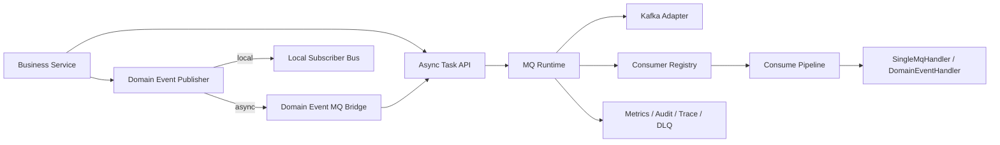
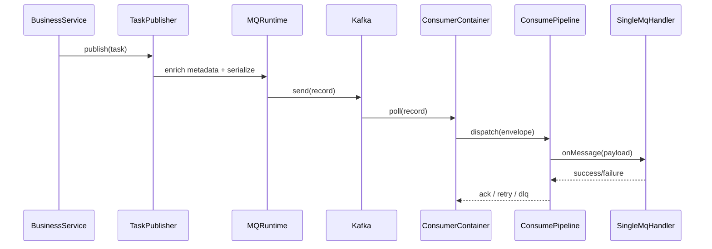
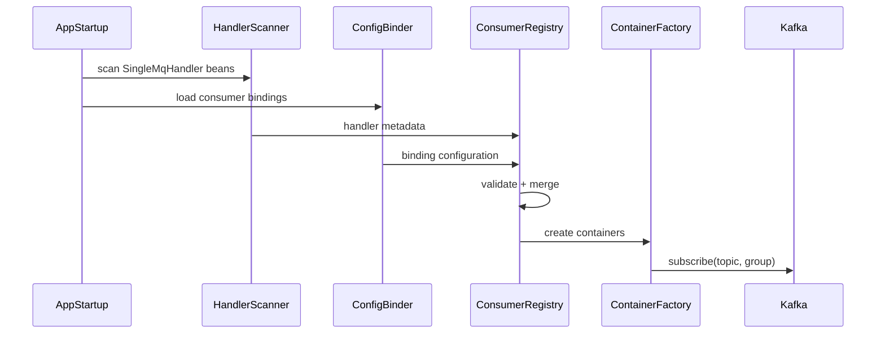
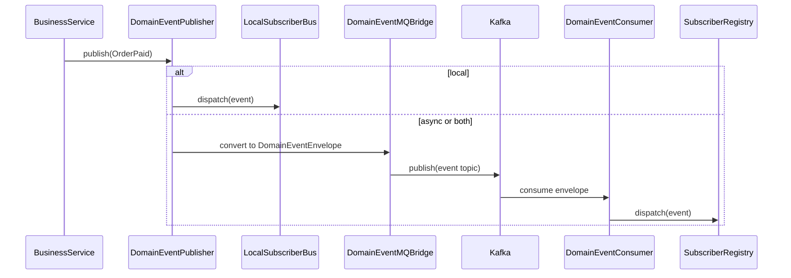
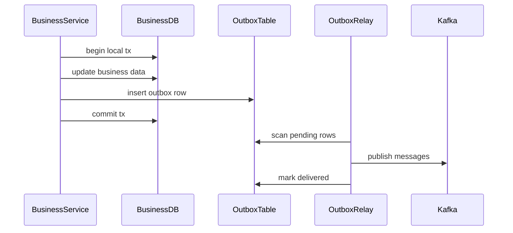

# AsyncMQ Platform on Kafka Technical Design

## Document Control

| Field | Value |
| --- | --- |
| Status | Draft |
| Authors | TBD |
| Reviewers | TBD |
| Last Updated | 2026-04-15 |
| Target Release | TBD |
| Related Project | Event Platform Async Messaging Foundation |

---

## Table of Contents

1. [Overview](#1-overview)
2. [Goals and Non-Goals](#2-goals-and-non-goals)
3. [Architecture Overview](#3-architecture-overview)
4. [Module Boundaries](#4-module-boundaries)
5. [Configuration Model](#5-configuration-model)
6. [Message Model](#6-message-model)
7. [Runtime Design](#7-runtime-design)
8. [Domain Event Integration](#8-domain-event-integration)
9. [Reliability, Retry, and Delivery Semantics](#9-reliability-retry-and-delivery-semantics)
10. [Observability and Operations](#10-observability-and-operations)
11. [Security and Governance](#11-security-and-governance)
12. [Sequence Diagrams](#12-sequence-diagrams)
13. [Implementation Phases](#13-implementation-phases)
14. [Risks and Open Questions](#14-risks-and-open-questions)
15. [Appendix](#15-appendix)

---

## 1. Overview

### 1.1 Background

The goal of this design is to build a platform-level asynchronous messaging foundation on top of Kafka for Java services. The design is inspired by the asyncMQ usage patterns already proven in `event-platform`, where business modules depend on a stable internal abstraction rather than Kafka APIs directly.

The target system should support:

- asynchronous business task dispatch
- configuration-driven consumer registration
- context propagation and cleanup
- routing and broadcast semantics
- retry and dead letter handling
- domain event publication through either local dispatch or MQ transport

### 1.2 Design Principle

Business code should express intent such as "publish a task", "consume a task", "publish a domain event", or "subscribe to a domain event". It should not manage Kafka producers, Kafka consumers, partition assignment, headers, retry topics, or thread-local cleanup.

### 1.3 Problem Statement

If teams build on raw Kafka clients directly, the same problems tend to be reimplemented repeatedly:

- inconsistent topic naming and message contracts
- duplicated producer and consumer bootstrap logic
- ad hoc retry and DLQ behavior
- inconsistent trace and tenant propagation
- missing cleanup of thread-local or request-scoped state
- domain events tightly coupled to transport details

This design centralizes those concerns into a reusable messaging platform.

---

## 2. Goals and Non-Goals

### 2.1 Goals

- Provide a Kafka-backed async task platform with stable internal APIs.
- Keep business modules decoupled from Kafka client classes.
- Support configuration-driven consumer registration and startup validation.
- Provide a unified consume pipeline for context recovery, routing, retry, DLQ, and metrics.
- Integrate domain event publication with both local and MQ-backed delivery modes.
- Support ordered processing by key.
- Support broadcast-style consumption for selected use cases.
- Make operational behavior observable and governable.

### 2.2 Non-Goals

- Exactly-once delivery for all workloads.
- A multi-language SDK in the first phase.
- Native Kafka delay semantics in v1.
- Full workflow orchestration or saga engine capability.
- Replacing every synchronous domain interaction with events in phase 1.

### 2.3 Success Criteria

- A new service can publish and consume tasks without importing Kafka APIs.
- A new consumer can be added with configuration only for topic, group, subtopic, and concurrency binding.
- A domain event can switch between local and MQ-based delivery without changing business publisher code.
- Core runtime concerns are handled in one platform layer, not in each business handler.

---

## 3. Architecture Overview

### 3.1 High-Level Architecture



### 3.2 Main Design Decisions

| Area | Decision |
| --- | --- |
| Business API | Business code uses platform abstractions, not Kafka client classes |
| Producer model | All outbound messages are wrapped in a platform-defined envelope |
| Consumer model | Handlers are discovered by type and bound through configuration |
| Dispatch model | Topic is coarse-grained, subTopic is fine-grained |
| Retry model | Default to at-least-once with retry and DLQ support |
| Domain Event model | Domain events are transport-independent and may be delivered locally or via MQ |
| Ordering model | Ordering is guaranteed by partition key, not by single-thread business code |

### 3.3 Core Runtime Responsibilities

- envelope creation and schema versioning
- metadata injection and propagation
- consumer registration and topology validation
- subTopic-based handler dispatch
- routing and filtering
- retry and DLQ
- metrics, tracing, and audit
- cleanup of execution context after consumption

---

## 4. Module Boundaries

### 4.1 Proposed Modules

| Module | Responsibility | Allowed Dependencies |
| --- | --- | --- |
| `mq-core-api` | Public platform abstractions for tasks, handlers, publisher APIs, result models | No Kafka dependency |
| `mq-runtime` | Producer wrapper, consumer registry, dispatch, retry, DLQ, routing, consume pipeline | Depends on `mq-core-api` |
| `mq-kafka-adapter` | Kafka producer and consumer integration, serialization, header mapping, partition routing | Only module allowed to depend on Kafka clients |
| `mq-spring-starter` | Spring auto-configuration, bean scanning, config binding, startup validation | Depends on runtime and adapter |
| `mq-observability` | Metrics, audit models, tracing hooks, redaction helpers | Reusable by runtime |
| `domain-event-core` | Domain event base model, publisher, subscriber registry, local dispatch | No MQ dependency |
| `domain-event-mq-bridge` | Converts domain events to MQ envelopes and back | Depends on `domain-event-core` and `mq-runtime` |
| `delay-scheduler` | Delay and fixed-time delivery service | Depends on runtime and chosen storage |
| `outbox-relay` | Transactional outbox polling and message relay | Depends on runtime and persistence layer |

### 4.2 Boundary Rules

- Only `mq-kafka-adapter` may import Kafka client packages.
- Business modules may depend on `mq-core-api` and `domain-event-core`.
- Business modules must not reference topic names directly except via bounded configuration or topic catalog abstractions.
- `domain-event-core` must not import `mq-runtime`.
- Retry, routing, and cleanup logic must not be implemented inside business handlers.

### 4.3 Why These Boundaries Matter

This separation keeps business workflows stable even if transport, serialization, retry strategy, or deployment topology evolves later.

---

## 5. Configuration Model

### 5.1 Configuration Groups

| Group | Purpose |
| --- | --- |
| `mq.connection` | Kafka cluster connection and security settings |
| `mq.producer` | Producer defaults such as acks, retries, linger, batch, compression |
| `mq.consumer.bindings` | Configuration-driven consumer topology |
| `mq.retry` | Retry topics, DLQ topics, backoff, max attempts |
| `mq.routing` | Region, tenant, cluster, and account routing rules |
| `mq.delay` | Delay scheduler settings |
| `domain-event.delivery` | Local vs async mode, event topics, subscriber behavior |
| `runtime.control` | Dynamic switches for pausing, throttling, or redirecting consumption |

### 5.2 Consumer Binding Model

Each handler is bound by configuration rather than by code-only declarations.

| Field | Description |
| --- | --- |
| `name` | Logical binding name |
| `handlerClass` | Fully qualified handler class name |
| `enabled` | Whether this consumer binding is enabled |
| `topic` | One topic or a list of topics |
| `group` | Consumer group name |
| `subTopics` | Supported subtopics for dispatch |
| `consumeMode` | `normal`, `broadcast`, or `sequential` |
| `broadcastScope` | `all-instance` or `regional-instance` |
| `concurrency` | Number of consumer worker threads or containers |
| `maxPollRecords` | Per-poll batch size |
| `retryPolicy` | Retry profile name |
| `routingPolicy` | Routing rule profile name |
| `startupMode` | `fail-fast` or `warn-and-disable` |

### 5.3 Producer Policy Model

| Field | Description |
| --- | --- |
| `acks` | Producer acknowledgment strategy |
| `retries` | Send retry count |
| `lingerMs` | Kafka batching latency |
| `batchSize` | Kafka producer batch size |
| `compressionType` | Compression algorithm |
| `requestTimeoutMs` | Send timeout |
| `defaultTopicCatalog` | Default topic catalog source |
| `defaultSchemaVersion` | Envelope schema version |

### 5.4 Retry and DLQ Policy Model

| Field | Description |
| --- | --- |
| `maxAttempts` | Maximum number of delivery attempts |
| `backoffType` | Fixed, exponential, or topic-based |
| `initialBackoffMs` | Initial backoff |
| `maxBackoffMs` | Maximum backoff |
| `retryTopic` | Retry topic name |
| `dlqTopic` | Dead letter topic name |
| `poisonTopic` | Special topic for malformed messages |
| `nonRetryableExceptions` | Explicit non-retryable exception classes |

### 5.5 Example Configuration Shape

```yaml
mq:
  connection:
    bootstrapServers: "kafka-a:9092,kafka-b:9092"
  consumer:
    bindings:
      order-created-consumer:
        handlerClass: "com.example.order.OrderCreatedHandler"
        enabled: true
        topic: "order_async_topic"
        group: "order-service"
        subTopics:
          - "order_created"
        consumeMode: "normal"
        concurrency: 4
        retryPolicy: "default-retry"
  retry:
    profiles:
      default-retry:
        maxAttempts: 5
        backoffType: "exponential"
        retryTopic: "order_async_retry_topic"
        dlqTopic: "order_async_dlq_topic"
```

### 5.6 Validation Rules

- A binding must resolve to at least one topic and one subTopic.
- Duplicate `(topic, group, subTopic, handler)` conflicts must fail startup.
- Broadcast mode must declare broadcast scope explicitly.
- Sequential mode must require key-based routing.
- DLQ and retry topic references must exist in the topic catalog.

---

## 6. Message Model

### 6.1 Task Envelope

All business tasks are represented as a platform-defined envelope.

| Field | Description |
| --- | --- |
| `taskId` | Unique task identifier |
| `traceId` | Distributed trace identifier |
| `name` | Logical task name |
| `topic` | Coarse-grained transport channel |
| `subTopic` | Fine-grained business dispatch key |
| `payload` | Business payload |
| `payloadType` | Canonical payload type name |
| `schemaVersion` | Envelope schema version |
| `key` | Partition key for ordered processing |
| `tracking` | Cross-thread request metadata |
| `routing` | Account, region, cluster, tenant routing metadata |
| `delivery` | Retry, delay, dedupe, and timing metadata |
| `producedAt` | Creation timestamp |

### 6.2 Tracking Metadata

| Field | Description |
| --- | --- |
| `requestId` | Request correlation id |
| `tenantId` | Tenant or account identifier |
| `userId` | Authenticated user id if applicable |
| `sourceService` | Producing service name |
| `domain` | Branding or request domain |
| `locale` | Locale if needed by async processor |
| `securityContext` | Minimal propagated auth context |

### 6.3 Routing Metadata

| Field | Description |
| --- | --- |
| `accountId` | Primary account routing key |
| `region` | Region identifier |
| `cluster` | Cluster identifier |
| `tenantShard` | Logical shard id |
| `sequentialKey` | Ordered processing key |
| `broadcastScope` | Broadcast routing hint |

### 6.4 Delivery Metadata

| Field | Description |
| --- | --- |
| `attempt` | Current attempt number |
| `maxAttempts` | Retry ceiling |
| `notBefore` | Delay scheduler visibility time |
| `dedupeKey` | Idempotency key |
| `ttl` | Optional time-to-live |
| `originTopic` | Initial topic before retry |

### 6.5 Domain Event Envelope

Domain events have a transport envelope separate from the task payload model.

| Field | Description |
| --- | --- |
| `eventId` | Unique event identifier |
| `eventName` | Business event name |
| `eventClassName` | Event class name |
| `eventData` | Serialized event body |
| `traceId` | Trace identifier |
| `producerServiceName` | Originating service |
| `allowOtherGroupConsume` | Whether other groups may consume |
| `targetClusters` | Cluster targeting for broadcast scenarios |
| `eventType` | Normal, slow, retry, or custom event category |
| `routingAccountId` | Primary routing account |
| `delayMs` | Delayed delivery hint |

### 6.6 Kafka Mapping

| Kafka Part | Platform Mapping |
| --- | --- |
| `record.key` | `sequentialKey` if present, else primary routing key |
| `record.value` | Serialized envelope |
| `headers.traceId` | `traceId` |
| `headers.taskId` | `taskId` or `eventId` |
| `headers.subTopic` | `subTopic` |
| `headers.payloadType` | `payloadType` |
| `headers.schemaVersion` | `schemaVersion` |
| `headers.notBefore` | delay metadata if applicable |

### 6.7 Versioning Strategy

- Envelope structure is versioned independently from business payloads.
- New fields must be backward compatible whenever possible.
- Consumers should tolerate unknown fields.
- Event names should remain stable even if event classes are renamed.

---

## 7. Runtime Design

### 7.1 Producer Runtime

The producer runtime is responsible for:

- generating task ids and trace ids where absent
- applying default metadata
- validating topic and subTopic
- serializing envelope and payload
- setting record key for partitioning
- emitting producer metrics and audit events

### 7.2 Consumer Registry

At application startup, the registry performs the following:

1. Scan all beans implementing `SingleMqHandler`.
2. Read consumer bindings from configuration.
3. Match handlers to configured bindings.
4. Validate topic, group, subTopic, concurrency, and retry policy.
5. Create one or more consumer containers.
6. Register subTopic dispatch tables.
7. Start consumption with startup validation logs.

### 7.3 Consumer Container Model

| Component | Responsibility |
| --- | --- |
| `ContainerFactory` | Creates topic/group consumer containers |
| `PollLoop` | Polls Kafka records and converts them into envelopes |
| `Dispatcher` | Dispatches envelopes to handlers by subTopic |
| `OffsetManager` | Controls commit timing |
| `FailureRouter` | Routes failed messages to retry, DLQ, or poison topics |

### 7.4 Consume Pipeline

Every consumed message passes through the same runtime pipeline:

1. deserialize Kafka record
2. validate envelope schema
3. recover trace and execution context
4. apply routing and cluster filters
5. run idempotency or dedupe check if enabled
6. invoke business handler
7. determine ack, retry, or DLQ behavior
8. emit metrics and audit logs
9. clean up execution context

### 7.5 SubTopic Dispatch

The platform uses topic plus subTopic dispatch rather than topic-only dispatch.

Benefits:

- fewer topics for related business flows
- simpler topic governance
- handler-specific dispatch without extra Kafka consumers
- easier evolution of business operations under one channel

### 7.6 Broadcast Semantics

Kafka does not provide true broadcast semantics for shared groups. The platform emulates broadcast by using instance-unique or region-unique consumer groups, depending on the configured scope.

### 7.7 Ordered Processing

Ordered processing is guaranteed only within a key. The runtime sets Kafka record keys based on the declared sequential key. Business handlers must not assume global ordering.

### 7.8 Delay and Fixed-Time Tasks

Kafka is not the primary scheduling engine for delayed delivery in v1. The platform will support delay and fixed-time tasks through a dedicated scheduler component that stores delayed tasks and releases them to Kafka when due.

---

## 8. Domain Event Integration

### 8.1 Domain Event Goals

The domain event subsystem exists to model business facts independently from transport.

Examples:

- `OrderPaid`
- `TicketAssigned`
- `HostProfileUpdated`
- `RefundCompleted`

### 8.2 Domain Event Core Model

| Component | Responsibility |
| --- | --- |
| `DomainEvent` | Base business event contract |
| `DomainEventPublisher` | Unified publish entrypoint |
| `DomainEventSubscriber` | Event consumer contract |
| `SubscriberRegistry` | Maps event name or event type to subscribers |
| `DeliveryStrategy` | Decides local, async, or both |

### 8.3 Delivery Modes

| Mode | Behavior |
| --- | --- |
| `local` | Event is dispatched only inside the current process |
| `async` | Event is published only through MQ |
| `both` | Event is first processed locally and also published via MQ |

### 8.4 MQ Bridge Responsibilities

The MQ bridge is the only transport-aware part of the domain event system.

Outbound bridge responsibilities:

- convert domain events into `DomainEventEnvelope`
- assign event topic and transport metadata
- publish using the generic task publisher

Inbound bridge responsibilities:

- consume event envelopes from Kafka
- restore the concrete domain event
- enforce cluster and group delivery rules
- dispatch the event to the local subscriber registry

### 8.5 Why the Bridge Pattern Is Required

Without this bridge:

- domain events become tightly coupled to Kafka topic details
- switching between local and MQ delivery becomes invasive
- event versioning and transport metadata become mixed into business event classes

### 8.6 Cluster and Group Constraints

Some events must only be consumed by the producer's own service group. Others may be shared across groups or clusters. This behavior is represented by transport metadata such as `allowOtherGroupConsume` and `targetClusters`, not by hard-coded business rules.

### 8.7 Recommended Rule

Domain events should always be published through `DomainEventPublisher`, never by directly constructing MQ tasks in business services.

---

## 9. Reliability, Retry, and Delivery Semantics

### 9.1 Delivery Semantics

The default delivery contract is at-least-once.

This implies:

- handlers may receive duplicates
- handlers must be idempotent for critical operations
- retries must not create incorrect business side effects

### 9.2 Retry Strategy

| Failure Type | Action |
| --- | --- |
| Serialization failure | Route to poison topic |
| Non-retryable business error | Route to DLQ |
| Retryable transient error | Retry according to policy |
| Infrastructure timeout | Retry according to policy |
| Validation error | Usually DLQ or poison depending on cause |

### 9.3 DLQ Strategy

DLQ messages must preserve:

- original envelope
- original topic and partition metadata
- failure class
- failure message
- failure timestamp
- attempt count

### 9.4 Idempotency Strategy

The platform will support idempotency keys but business modules remain responsible for choosing appropriate idempotent storage semantics.

Typical options:

- database unique key
- cache token with TTL
- processed task table
- natural business key

### 9.5 Outbox for Transactional Consistency

For database plus MQ consistency, the recommended phase-1 approach is transactional outbox:

1. commit business data and outbox row in one local transaction
2. relay service reads outbox rows
3. relay publishes to MQ
4. relay marks outbox row delivered

Kafka transactions may be evaluated later for specific advanced use cases but are not the default design.

---

## 10. Observability and Operations

### 10.1 Required Metrics

| Metric | Description |
| --- | --- |
| publish success rate | Producer send success ratio |
| publish latency | Producer send latency |
| consume throughput | Messages processed per unit time |
| consume latency | End-to-end processing latency |
| retry count | Number of retries |
| DLQ rate | Number of DLQ messages |
| poison rate | Number of malformed messages |
| lag | Consumer lag by topic and group |
| handler error rate | Error rate per handler |

### 10.2 Audit Logging

Each consumed message should be auditable by:

- topic
- subTopic
- group
- handler
- taskId or eventId
- traceId
- attempt
- processing duration
- result

### 10.3 Operational Controls

The platform should provide runtime controls for:

- pausing a binding
- reducing concurrency
- switching retry policies
- disabling a handler binding
- redirecting traffic to a new topic during migration

### 10.4 Alerting Recommendations

- consumer lag exceeds threshold
- DLQ rate exceeds threshold
- repeated poison messages
- handler failure spikes
- retry storm on a binding
- outbox backlog growth

---

## 11. Security and Governance

### 11.1 Security Requirements

- support Kafka auth and encryption
- restrict payload logging by default
- sanitize sensitive headers
- propagate only the minimum required security context
- define topic-level ACL expectations

### 11.2 Data Governance

The platform must support:

- payload redaction for logs
- schema ownership
- retention policy by topic category
- PII classification for message contracts

### 11.3 Governance Recommendations

- define a topic catalog with owners and retention rules
- require schema review for new envelope-breaking changes
- require retry policy review for new critical handlers
- require idempotency review for mutation handlers

---

## 12. Sequence Diagrams

### 12.1 Async Task Publication and Consumption



### 12.2 Configuration-Driven Consumer Registration



### 12.3 Domain Event Local and MQ Delivery



### 12.4 Outbox Relay



---

## 13. Implementation Phases

### Phase 0: Foundation

Deliverables:

- `mq-core-api`
- `mq-kafka-adapter`
- basic producer and consumer bootstrap
- envelope serialization contract

### Phase 1: Async Task Runtime

Deliverables:

- `TaskEnvelope`
- `TaskPublisher`
- `SingleMqHandler`
- subTopic dispatch
- basic startup validation

### Phase 2: Configuration-Driven Registration

Deliverables:

- binding configuration model
- handler scan and merge
- container lifecycle
- duplicate binding checks

### Phase 3: Consume Pipeline and Reliability

Deliverables:

- context recovery and cleanup
- retry router
- DLQ and poison topic
- metrics and audit
- idempotency extension points

### Phase 4: Domain Event Integration

Deliverables:

- `domain-event-core`
- `domain-event-mq-bridge`
- local, async, and both delivery modes
- event consumer and subscriber dispatch

### Phase 5: Advanced Capabilities

Deliverables:

- delay scheduler
- fixed-time tasks
- cluster routing
- broadcast refinements
- runtime traffic controls

### Phase 6: Consistency and Governance

Deliverables:

- outbox relay
- topic catalog
- schema governance
- operational handbook
- migration guide for raw Kafka users

---

## 14. Risks and Open Questions

### 14.1 Main Risks

| Risk | Description | Mitigation |
| --- | --- | --- |
| Over-abstracting too early | Platform API may become too generic or hard to evolve | Start with task and event primitives only |
| Topic sprawl | Too many topics created without ownership | Introduce topic catalog and naming review |
| Retry storms | Misconfigured retries may amplify failures | Enforce max attempts and alerts |
| Hidden coupling | Business handlers may rely on local-only state | Enforce context contract and cleanup |
| Schema drift | Producers and consumers evolve separately | Version envelope and tolerate unknown fields |

### 14.2 Open Questions

- Should v1 use JSON only, or adopt Avro or Protobuf from the start?
- What is the preferred storage for the delay scheduler: database, Redis, or dedicated service?
- Which configuration center should back dynamic runtime control?
- Should broadcast consumers use host identity, pod identity, or region-scoped identity?
- Which observability backend is the standard destination for metrics and audit logs?

---

## 15. Appendix

### 15.1 Recommended Naming Conventions

| Entity | Convention |
| --- | --- |
| Topic | `<domain>_<channel>_topic` |
| Retry topic | `<topic>_retry` |
| DLQ topic | `<topic>_dlq` |
| Poison topic | `<topic>_poison` |
| subTopic | `<bounded_context>_<business_action>` |
| Consumer group | `<service>` or `<service>_<region>` |

### 15.2 Recommended Handler Contract

Business handlers should focus only on:

- payload validation
- business processing
- explicit success or failure result

Business handlers should not implement:

- Kafka client lifecycle
- manual thread-local cleanup
- retry topic logic
- tracing bootstrap
- generic audit logging

### 15.3 Example Adoption Path for a New Service

1. Define task payload and subTopic.
2. Register producer usage through `TaskPublisher`.
3. Implement one `SingleMqHandler`.
4. Add consumer binding configuration.
5. Define retry and DLQ policy.
6. Add idempotency strategy if the handler mutates state.
7. Add metrics dashboards and alerts before production rollout.

